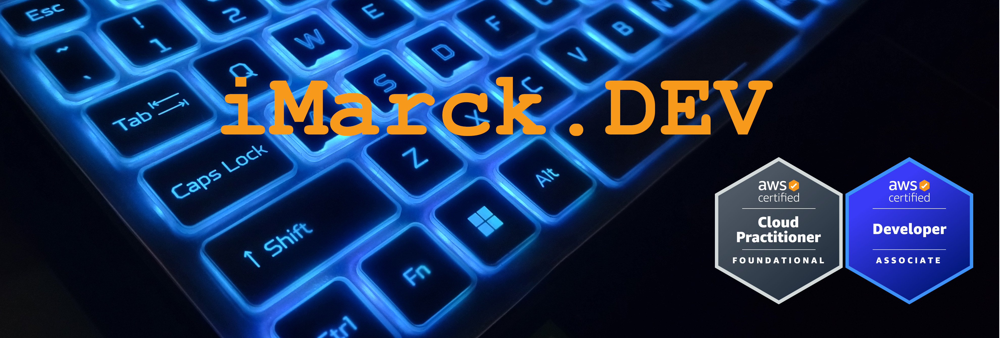

👋 Hi, I'm Marco Loaiza Delgado, aka iMarckDEV!

🚀 Electrical engineer with 10 years of hybrid experience, including 5 years in electrical projects and 5 years in the tech industry.

🎓 Master's degree in engineering, specializing in deep machine learning, IoT, and drones/robotics.

☁️ Cloud consultant at https://www.arkho.io in AWS Cloud, skilled in backend data engineering and developer.

💡 Curious and versatile with a wide range of hard and soft skills.

🌟 Let's collaborate on exciting projects! Explore my repos and reach out!
<!--
**iMarckDEV/iMarckDEV** is a ✨ _special_ ✨ repository because its `README.md` (this file) appears on your GitHub profile.

Here are some ideas to get you started:

- 🔭 I’m currently working on ...
- 🌱 I’m currently learning ...
- 👯 I’m looking to collaborate on ...
- 🤔 I’m looking for help with ...
- 💬 Ask me about ...
- 📫 How to reach me: ...
- 😄 Pronouns: ...
- ⚡ Fun fact: ...
-->
